# 基本介绍

本工具实现了基于持续学习（Continental Machine Learning）的机器学习模型演化与持续服务的过程。在学界，持续学习指根据数据的变化自动进行机器学习的过程，并且解决数据变化带来的概念漂移、灾难性遗忘等问题。该过程要求机器学习过程中使用的特征工程方法、建模方法与参数调优策略可以被自动化执行，同时可以根据数据特征自动探索到表现更好的特征、模型与参数。这种自动化特性使得该工具可以作为快速验证机器学习场景可行性的工具。

目前已经基于本工具提供了SaaS版平台服务，您可以观看以下视频学习如何创建你的第一个机器学习模型！

【点击下图跳转】

[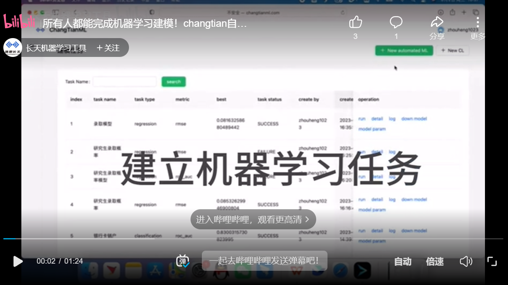](https://www.bilibili.com/video/BV1W14y1B7i4)

# 使用方法

下面通过一个案例演示如何通过本平台建立机器学习任务。

## 数据准备

为了用户方便理解，当前版本支持输入csv格式的数据文件，并且要求数据列分隔符为逗号，同时每个csv数据文件需要包含更新数据的表头。

【HINT】在正式版中有多种数据输入形式，可以搭配特有数据存储增强数据吞吐性能。 当前平台为免费用户开放了数据表形式的结构化数据输入方式。数据表形式的序列、以及更多数据形式会在后续版本中陆续开放。

## 任务配置

登录平台后，点击页面右上方【新建自动化机器学习】按钮，弹出【新建任务】对话框。

首先将准备好的数据文件上传到平台，这里可以上传多个数据文件，并且它们的数据格式与数据字段必须相同。上传完毕之后点击【下一步】。

点击【下一步】，可以预览所上传的数据。

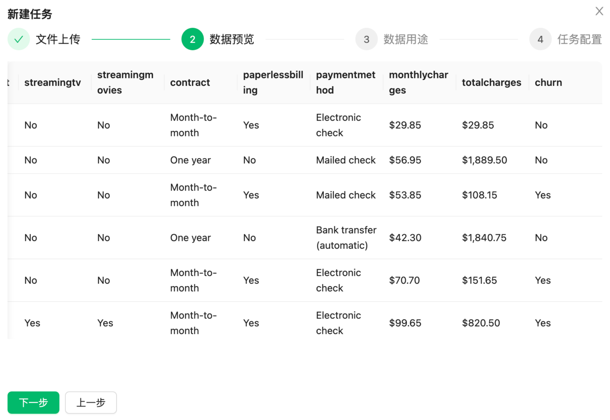

继续点击【下一步】，平台会自动解析文件中每个字段的类型。此时需要用户确认如下内容：

⊖ 确认该数据集中需要拟合的字段，在对应字段的下拉列表中选择“标签”，默认情况下为“特征”。

⊖ 确认该数据集中不需要用到的字段，在对应字段的下拉列表选择“忽略”。

⊖ 确认标签和特征所对应的字段中属于非数值的类别特征字段，并将类别特征的字段设置为开启状态。

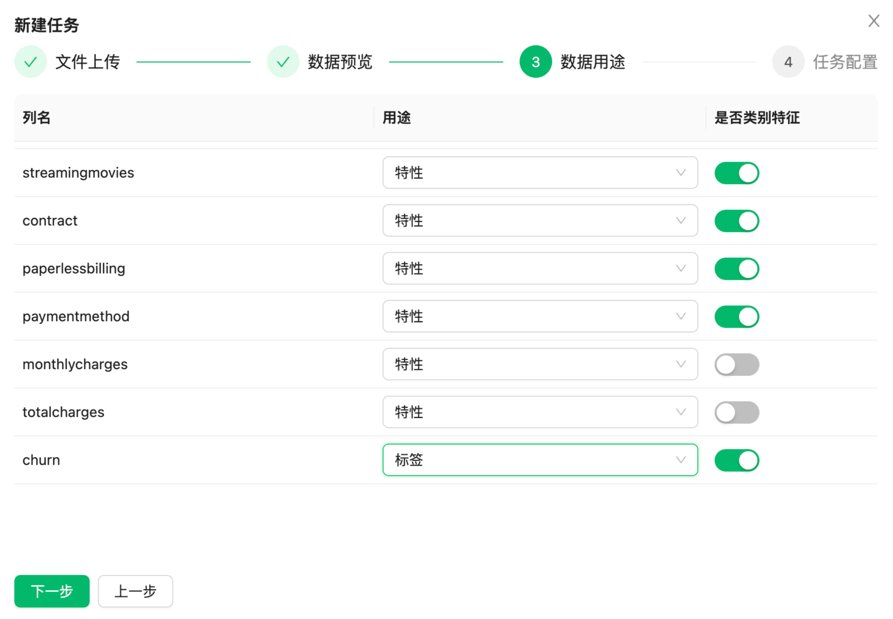

该案例中选择预测字段“churn”。点击【下一步】设置任务名称、自动化特征工程尝试次数、自动化机器学习尝试时间，备注等信息，然后点击【确定】则任务创建完毕。

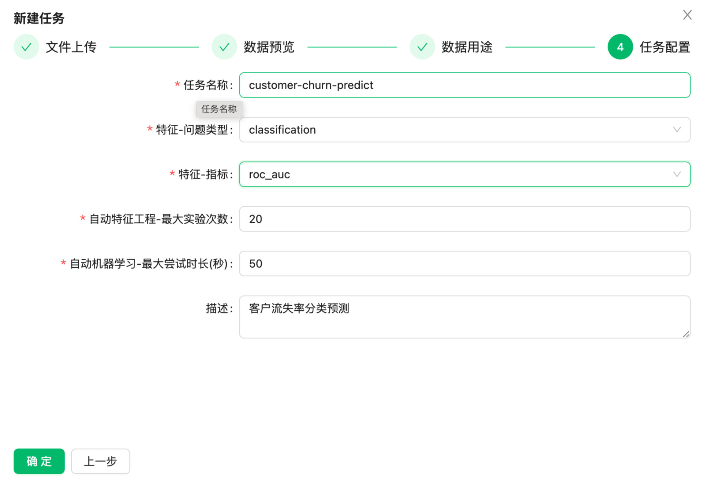

【特征-问题类型】下拉选项中提供classification（分类）和regression（回归）两种机器学习任务类型的选择。如果标签为类别特征则是分类问题；如果标签为数值则是回归问题。本案例中选择“classification”。

【特征-指标】下拉选项中提供了多种机器学习评判指标。如果当前解决的是分类问题则选择“roc_auc”和“log_loss”作为评判指标；如果当前解决的是回归问题则选择“rmse”作为判断指标。

【HINT】一般而言，当log_loss取值小于0.693即表示模型有拟合能力，且越小越好；当roc_auc取值范围为0.5～1，越大越好，当大于0.7即表示模型有良好分辨能力。

完成任务配置之后在【建模任务】列表中可以查看到所创建的任务。

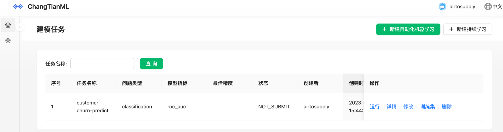

## 模型训练

在【建模任务】列表选择创建好的任务点击【运行】即可，整个建模过程都是全自动化的。

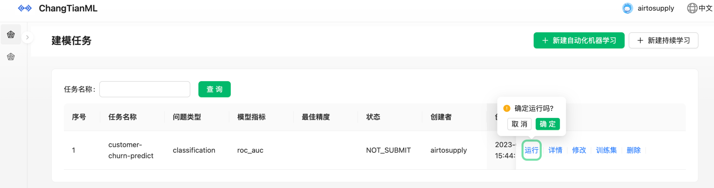

任务运行完毕之后会显示当前模型训练的最佳精度，可以看到这里的最佳精度大约为0.82，并且任务状态为SUCCESS。

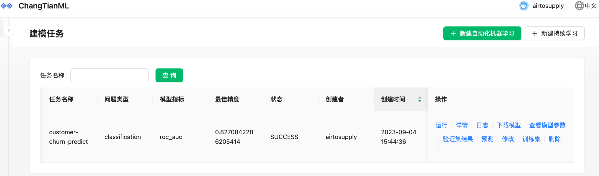

## 模型查看

在【建模任务】列表选择对应任务点击【日志】按钮可以查看相关整个持续学习过程中的自动化特征工程和自动化机器学习的相关细节。

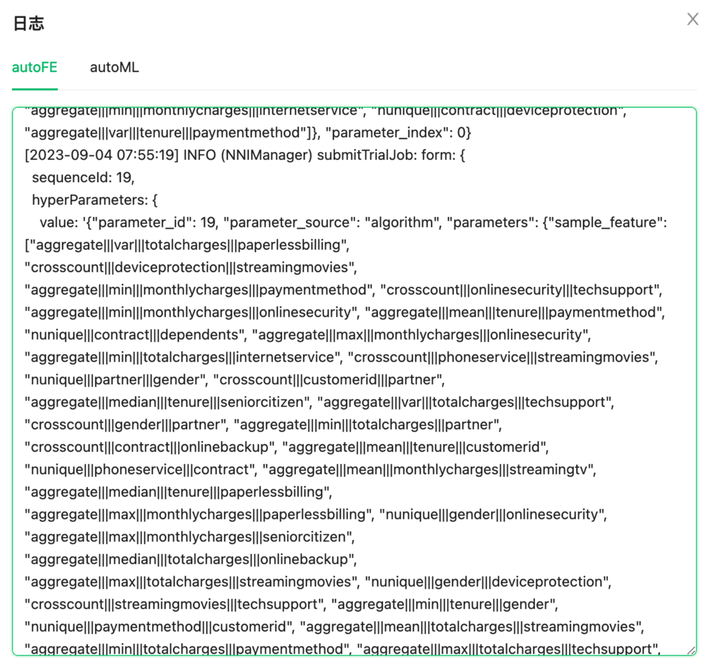

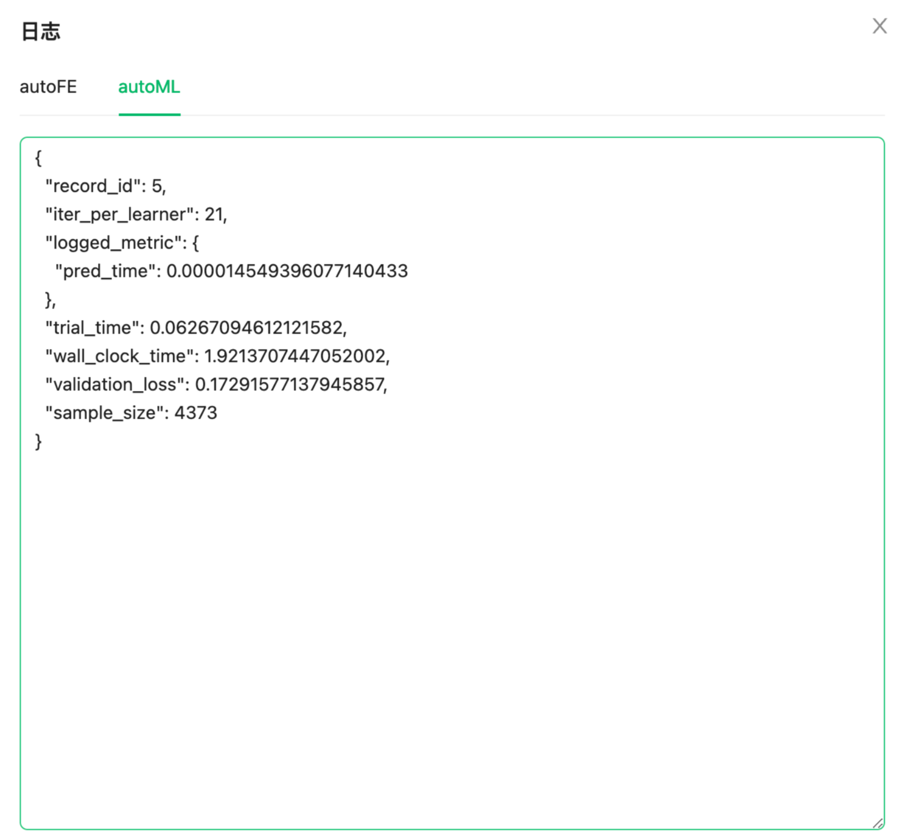

用户可以通过这些日志更好的了解机器学习模型演化与持续服务的过程。也可以点击【查看模型参数】查看模型相关参数。

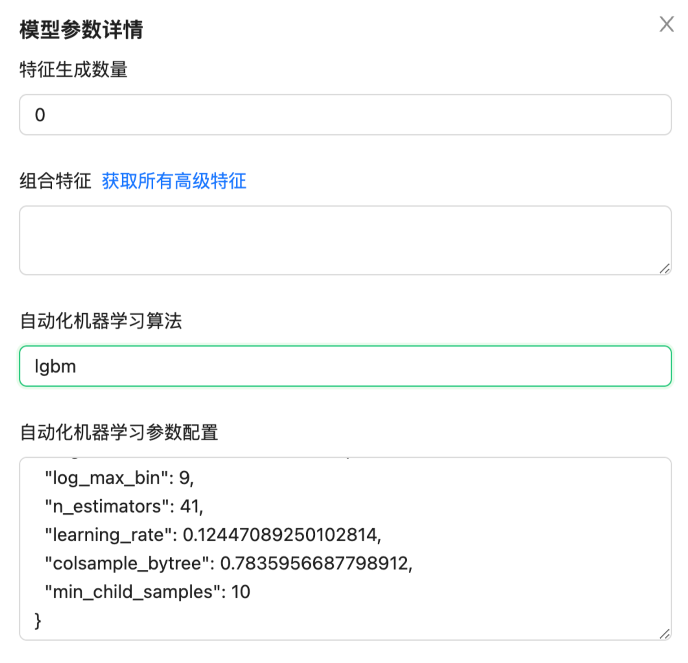

另外用户还可以点击【验证集结果】查看该模型对上传数据文件中的数据所预测的结果。

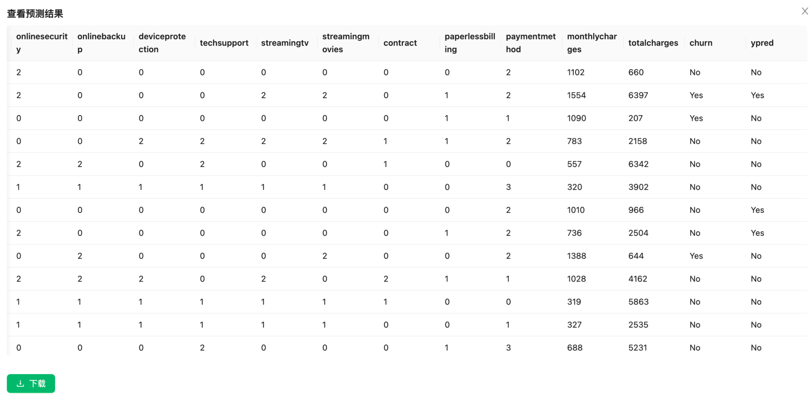

在本案例中模型所预测的字段是“churn”这一列，这里所展示的“ypred”这一列为模型预测的结果。

## 模型预测

在【建模任务】列表选择对应任务点击【预测】可以进行模型预测。

此时可以将需要预测的数据文件上传到平台，这里对上传数据文件的要求和“数据准备”环节是数据文件要求是一致的。

点击【上传并预测】，稍等片刻在【数据预览】中所展示的数据则是通过训练好的模型所预测的结果。

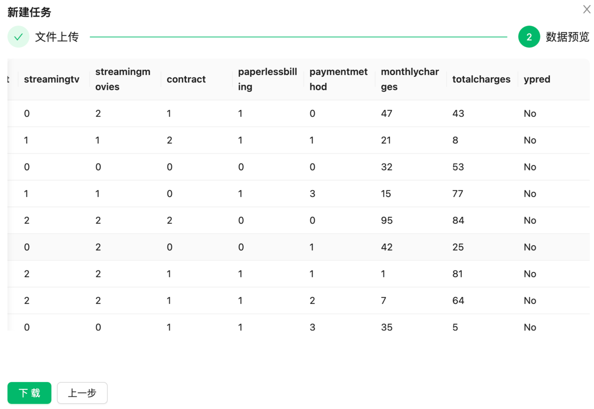

这里的“ypred”这一列就是模型预测的结果，可以点击【下载】将预测结果下载到本地。

至此，通过该平台完成了一个分类任务自动化建模的整个过程的演示。同时该平台通过自动建模工具可以让用户都能够更加便捷，高效的建立机器学习模型并完成机器学习相关的工作。
